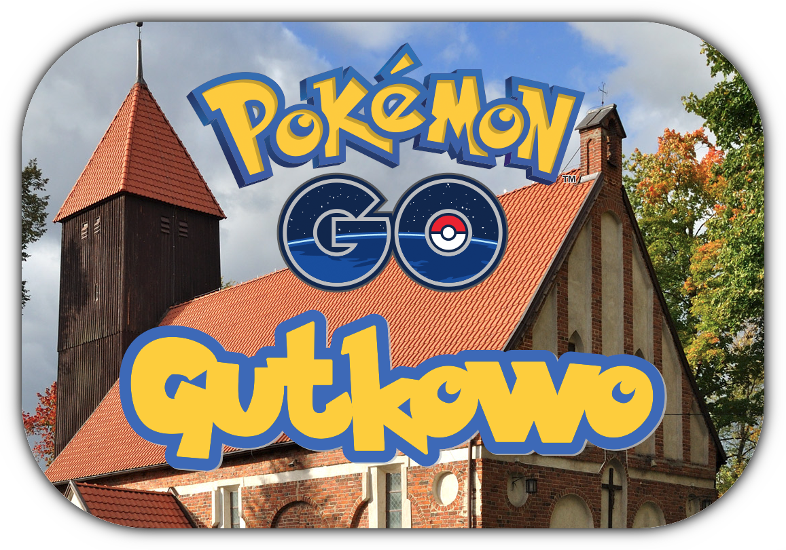

# PokeGutkowo
\
Aplikacja mająca na celu zrzeszenie gutkowiańskich graczy PokemonGO.\
*Cii, mam fobię społeczną i pewnie jej nigdy nie użyję, ale może się uda XD*

### Wymagania:
* Python 3.7
* Django 2.2.4

### Testowane:
* macOS Mojave (10.14.6) + native Python 3.6

# Instalacja zależności
```
pip install -r requirements.txt
```
